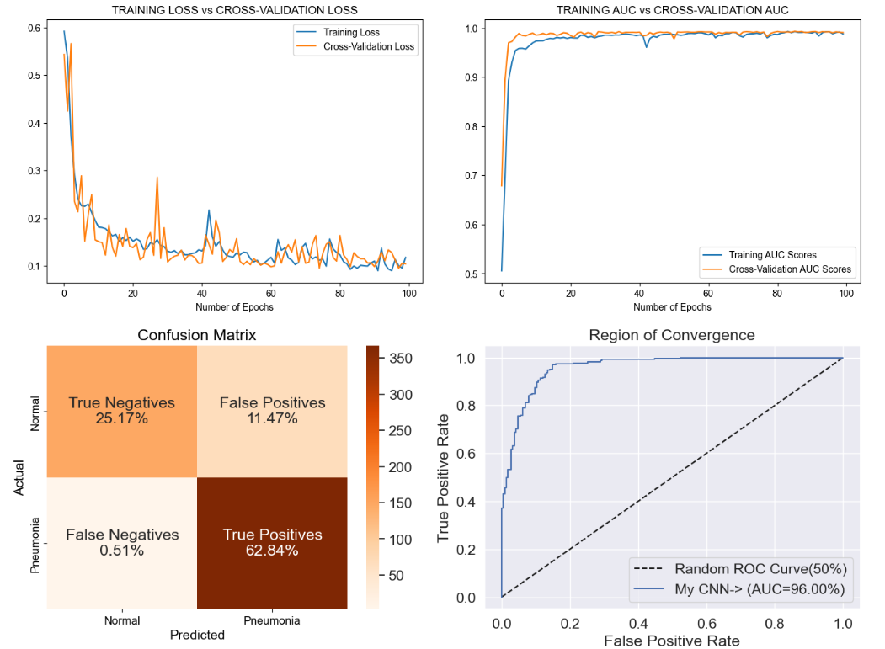

<h1>Pneumonia Detection Deep Neural Network Model</h1>
<h2>Aim: </h2>
Pneumonia, an inflammatory condition of the lungs, is a leading cause of morbidity and mortality worldwide. Early and accurate diagnosis is crucial for effective treatment and better patient outcomes. Traditional methods for diagnosing pneumonia, such as chest X-rays, rely heavily on the expertise of radiologists, which can lead to variability in interpretation and potential delays in diagnosis. To address these challenges, this project aims to develop a robust Pneumonia Detection algorithm leveraging deep learning techniques.

<h2>About Pneumonia: </h2>
Pneumonia is a lung infection that makes it hard to breathe. It can be caused by bacteria, viruses, or fungi. When someone has pneumonia, the tiny air sacs in their lungs fill with fluid, causing symptoms like coughing, fever, chills, and difficulty breathing.
Anyone can get pneumonia, but it is more dangerous for very young children, elderly people, and those with other health problems. Doctors use chest X-rays and other tests to diagnose pneumonia and usually treat it with medications to fight the infection. Early treatment is important to avoid serious complications.

<h2>Step-by-step procedure: </h2>
<h3>Dataset: </h3>
I have used a Chest X-Ray dataset from <a href="https://www.kaggle.com/">Kaggle</a> (link at the end of this subpoint). There are 5856 Chest X-Ray examples in the dataset. The dataset is already split into train, cross-validation and test set. However, the main problem with the predefined split is that instead of a standard split of 70-15-15 , the validation set was around 0.27% of the dataset. Training a neural network with this split would give very bad results no matter what hyperparameter tuning or regularization I do. So, ultimately I did my own split of 70-20-10 on the dataset with a distribution of about 70% images for Pneumonia Positive and 30% for Pneumonia Negative.
Dataset Link: <a href="https://www.kaggle.com/datasets/paultimothymooney/chest-xray-pneumonia">Pneumonia Dataset</a>.

<h3>Data Preprocessing: </h3>
I have applied simple data augmentation to the different splits. The images were horizontally rotated along with shearing and zooming. I also normalized the pixels to limit their values from -1 to 1 by simply dividing each pixel value by 255 (The max value). Another detail to be noted is that the colour mode while augmentation was taken as Grayscale. An image X-Ray can be easily represented as a Grayscale image; this also reduces unnecessary computations as it lowers the image dimensions from (64 X 64 X 3) to (64 X 64 X 1).

<h3>Convolutional Neural Networks: </h3>
A Convolutional Neural Network (CNN) is a type of deep learning algorithm specifically designed for processing and analyzing visual data. CNNs are widely used in image recognition, computer vision, and various other tasks involving visual inputs due to their ability to automatically and adaptively learn spatial hierarchies of features from images. There networks are built by comprising convolutional layers as the main computational units. The main advantage of such layers is that they greatly reduce the number of parameters to be trained while efficiently capturing image features. 
You can view the following animation to get an idea on how convolutional layers work.

<h3>Neural Network Architecture: </h3>
In this section, I will show you the neural network used for this task. This is a Binary Classification task, where the model outputs the probability of an image being of Class 0: Pneumonia Negative or Class 1: Pneumonia Positive. This has been achieved by three Convolutional + MaxPooling layers. These layers can efficiently identify properties of the input image, and output another volume. However, in order to make predictions, this volume must to flattened to a 2-Dimentional Vector. Then this vector is passed as an input to 2 fully-connected dense layers. I have used a Relu activation for all the layers except the last layer (which uses sigmoid activation), because it is a binary classification.
You can see the neural network in the below image:

<h3>Model Performance: </h3>

The above graph shows the different model performance parameter graphs that I have plotted using matplotlib. Below are the descriptions of each performance parameter.
<ol>
  <li>Training Loss vs Validation Loss: </li>
  From this curve, it can be seen that the training and cross-validation losses converge quite well. There are some osscilations here and there but the end results seem very promising. We can see that overall, as the number of epochs increases, the overall losses decrease.
  <li>Training AUC vs Cross-Validation AUC: </li>
  The AUC score clearly shows how, as the learning steps increased the score increased rapidly, then flatlined at the top. This is very good results.
  <li>Confusion Matrix: </li>
  Confusion matrix was one of the more important metrics specially in this application as I had to keep a close eye on the recall of this algorithm. In the end it can be seen that the network was able to achieve a high recall system.
  <li>Region Of Convergence: </li>
  Finally, this curve shows us how better our neural network is compared to an algorithm that gets correct predictions 50% of the time (Randomly flagging positives). The general rule is the ROC should be kept as close to the top left corner as possible. As this approaches the middle, the performance gets worse.
</ol>
